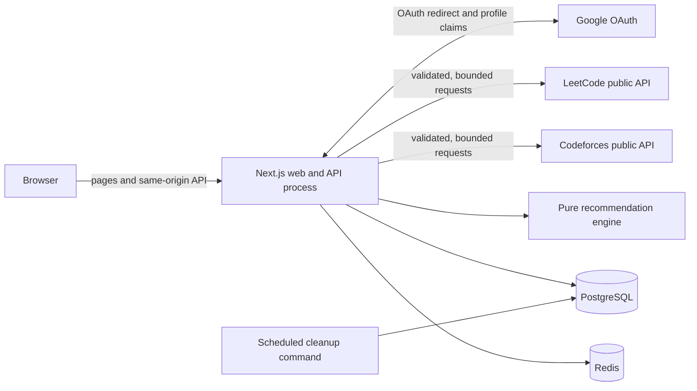
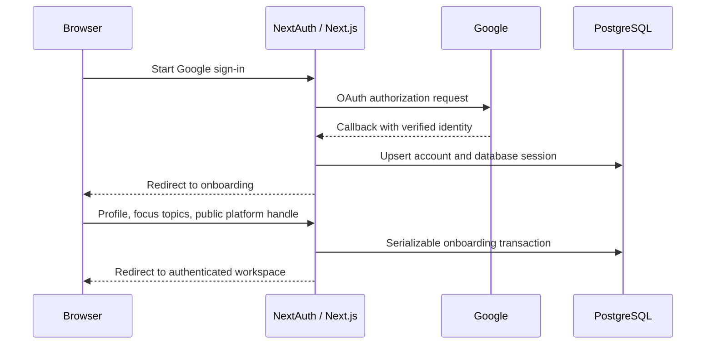

# Invariant v2 architecture

This document describes the checked-in v2 application. It is a deployment-neutral design reference, not evidence of a running hosted service.

## System context



Invariant is one Next.js application backed by PostgreSQL and Redis. There is no message broker or background worker in this repository. Recommendation generation, platform sync, analytics, and plan creation run in the request that initiated them. Retention is a separate command that an operator must schedule.

## Runtime components

### Next.js application

- App Router server components render public marketing pages, opt-in profiles, onboarding, and authenticated product pages.
- Small client components own interactions such as forms, theme switching, recommendation feedback, attempt logging, and chart rendering.
- Route handlers under `src/app/api` expose health, NextAuth, and versioned product endpoints.
- `src/proxy.ts` applies per-client rate limiting to `/u/*` before a public profile renders.
- `next.config.ts` emits a standalone build and common response-security headers.

### Authentication and authorization

NextAuth uses Google OAuth through the Prisma adapter. Only Google profiles with `email_verified=true` may sign in. The application stores sessions in PostgreSQL with a 30-day maximum age and a one-day update interval.

Authentication and product readiness are distinct:

1. `requireUser()` requires a valid database session and existing user.
2. `requireCompleteUser()` additionally requires a profile with `onboardingCompletedAt`.
3. Protected page layout code redirects anonymous users to sign-in and incomplete users to onboarding.
4. API routes repeat server-side authorization; the UI is not trusted as an access-control boundary.

Google is the only sign-in provider. Invariant does not implement a password database.

### PostgreSQL and Prisma

PostgreSQL is the system of record. Important model groups are:

| Group | Main models | Responsibility |
| --- | --- | --- |
| Identity | `User`, `Account`, `Session`, `VerificationToken`, `UserProfile` | OAuth identity, revocable sessions, onboarding, goals, and visibility. |
| Catalog | `Topic`, `TopicPrerequisite`, `Problem`, `ProblemTopic` | Curated problem metadata, topic weights, and prerequisite graph. |
| Learning state | `UserTopicPreference`, `UserTopicMastery`, `UserProblemState`, `Attempt`, `DailyActivity` | Focus, ability estimates, per-problem review state, immutable evidence, and aggregates. |
| Recommendations | `RecommendationRun`, `RecommendationItem`, `RecommendationEvent` | Versioned slates, component scores/reasons, and idempotent behavior events. |
| Plans | `StudyPlan`, `StudyPlanItem` | One active plan per user and its scheduled work. |
| Integrations | `PlatformIdentity`, `PlatformSnapshot` | Public handles and immutable aggregate snapshots. |

User-owned relations cascade when the user is deleted. Curated topics/problems are protected from accidental deletion where historical learning records refer to them. A PostgreSQL partial unique index enforces at most one active study plan per user.

The seed is idempotent: it upserts the curated topic graph and catalog, rewrites problem-topic links, and deactivates removed seeded problems rather than deleting historical references.

### Redis

Redis stores atomic fixed-window counters for route and public-profile rate limits. Keys contain a namespace and SHA-256 digest rather than the raw user/client identifier.

If Redis is missing or temporarily unavailable, the application falls back to a bounded in-process map. That fallback is useful for local continuity, but it is isolated per process and therefore does not provide a global limit across replicas. Production readiness requires configured, reachable Redis.

Redis is not the recommendation cache. Recommendation runs are persisted in PostgreSQL; public profile projections use the Next.js data cache.

### External platform adapters

LeetCode sync sends a fixed GraphQL document for public aggregate solve counts, ranking, and reputation. Codeforces sync calls `user.info` and up to 10,000 public status records to count unique accepted problems and capture rating.

Both adapters use a shared fetch boundary that:

- disables framework caching and redirects;
- applies an abort timeout;
- bounds declared and actual response sizes;
- validates JSON against an explicit Zod schema;
- maps upstream failures to stable application errors.

Platform access requires only a public handle. Invariant never asks for a LeetCode or Codeforces password. Snapshot totals are displayed as external context; they are not treated as per-problem attempt evidence by the mastery model.

## Primary request flows

### Sign-in and onboarding



Onboarding is a one-time `PUT /api/v1/me`. It validates the profile, verifies selected topic IDs, initializes topic mastery from experience level, stores focus priorities, and creates the initial platform identity in one serializable transaction.

### Recommendation feed

1. A page or API asks `getRecommendations()` for a mode, limit, time budget, and profile context.
2. The service reuses a compatible non-expired PostgreSQL run when possible.
3. Otherwise it loads the active catalog, mastery, preferences, problem state, and bounded 90-day behavior history.
4. The pure engine filters, scores, assigns lanes, and diversifies candidates.
5. A transaction stores the run/items and updates `lastServedAt` for visible feeds.
6. The caller receives ranked problems, a separate solve probability, component values, and explanations.

Daily feed runs expire after 12 hours; other feed modes expire after 2 hours. Compatibility checks include requested capacity, time, premium flag, experience, learning goal, and target date. Attempts and relevant settings/events expire active runs early.

See [recommendation-system.md](recommendation-system.md) for the complete algorithm.

### Attempt recording

`POST /api/v1/attempts` requires a per-user idempotency key. The service verifies any recommendation attribution belongs to the current user, then uses a serializable transaction to:

- create the immutable attempt;
- update per-problem counts, state, best time, confidence, and FSRS card;
- update weighted topic mastery estimates;
- increment the user-timezone daily aggregate;
- mark matching study-plan work in progress or complete;
- record recommendation completion where applicable;
- expire active recommendation runs.

Concurrent serialization failures are retried up to three times. Reusing the same idempotency key with an identical payload returns the original attempt; reuse with a different payload returns a conflict.

### Platform sync

Saving a handle puts the identity into `PENDING`. Explicit sync is limited per user/platform and may return the most recent active snapshot inside the configured TTL.

Before making an upstream request, the route records the identity ID, normalized handle, and update timestamp. The snapshot commit uses that version as a compare-and-set condition so results for an old handle cannot be attached after the user changes it. Successful sync writes identity state and an immutable snapshot transactionally.

### Public profiles

`/u/[handle]` queries only profiles with `isPublic=true` and completed onboarding. The data service returns an allowlisted projection: public profile fields, aggregate progress, topic mastery, and active public-platform snapshots. It does not select or serialize email, sessions, OAuth account fields, notes, individual attempts, plans, or recommendation history.

The projection has a shared 60-second Next.js cache keyed and tagged by normalized handle. Relevant profile, topic, attempt, platform, and deletion mutations explicitly expire the tag. The route also receives a per-client fixed-window guard. Reverse proxies must replace, not append arbitrary client-supplied forwarding headers, because the limiter derives its key from the forwarded client address.

Private, invalid, incomplete, and unknown handles all produce `notFound()` behavior and noindex metadata.

## API boundary

Standard v1 success responses are:

```json
{
  "data": {},
  "requestId": "uuid-or-trusted-upstream-id"
}
```

Standard failures are:

```json
{
  "error": {
    "code": "STABLE_MACHINE_CODE",
    "message": "Non-sensitive user-facing message",
    "details": {}
  },
  "requestId": "uuid-or-trusted-upstream-id"
}
```

Responses set `Cache-Control: no-store` and echo `x-request-id`. Known validation, application, and Prisma failures are mapped to stable status/code pairs; unexpected errors are logged with the request ID and returned as a non-leaky 500 response.

Mutation routes enforce the configured/request origin, validate JSON with strict schemas, cap bodies where the shared reader is used, check ownership, and apply route-specific rate limits. Account export is a streaming, rate-limited NDJSON response rather than the standard JSON envelope.

## Repository layout

```text
src/app/                    pages, layouts, route handlers
src/components/             UI, product, marketing, onboarding, shell
src/lib/auth.ts             NextAuth configuration and server guards
src/lib/services/           transactional product/application services
src/lib/recommendation/     pure ranking and mastery modules
src/lib/plans/              pure plan scheduling and lifecycle helpers
src/lib/platforms/          validated third-party adapters
src/lib/review-scheduler.ts FSRS adapter
src/lib/rate-limit.ts       Redis/memory rate limiting
src/lib/request-security.ts origin, client address, bounded JSON reader
prisma/schema.prisma        relational model
prisma/migrations/          v2 baseline and follow-up constraints
prisma/catalog.ts           reviewed topic/problem seed source
prisma/seed.ts              idempotent catalog seed
scripts/                    catalog validation and retention cleanup
docker/                     migration entrypoint
```

## Build and deployment shape

The Dockerfile uses dedicated stages:

1. `base` installs system certificates, OpenSSL, and `tini`.
2. `dependencies` installs the locked application tree, while `migration-dependencies` installs a separate pinned minimal Prisma/TS runtime.
3. `builder` creates a self-contained standalone Next.js build with non-secret placeholders.
4. `migrator` applies migrations/seeds and runs maintenance without carrying the web toolchain.
5. `runner` contains only the prepared standalone app and runs as an unprivileged user.

Compose starts PostgreSQL, password-protected Redis, the one-shot migrator, and the web process. Database and Redis host ports bind to `127.0.0.1`. The web container drops Linux capabilities and enables `no-new-privileges`.

Production operators should run migrations as a controlled release job, schedule `npm run db:cleanup` separately, use managed secret storage, retain tested database backups, and place the app behind HTTPS and a correctly configured reverse proxy.

## Operational behavior and limits

- `/api/health/live` proves that the web process can respond.
- `/api/health/ready` checks PostgreSQL, configured Redis, and production authentication configuration.
- `npm run db:cleanup` removes expired sessions/tokens, expired recommendation runs older than the configured window, and old platform snapshots while preserving the newest snapshot for every identity.
- Cleanup is not automatic; schedule and monitor it externally.
- The repository does not include metrics export, distributed tracing, a job queue, automated backup tooling, or a platform-specific deployment definition.
- Public-profile caching reduces repeated reads, but a cold public profile still performs several aggregate database queries.
- Codeforces sync is synchronous and can inspect a large bounded submission response; capacity planning should account for upstream latency.

## Trust boundaries

- Browser input is untrusted even after authentication.
- OAuth identity assertions are accepted only through NextAuth’s Google flow.
- Forwarded client-address headers are trusted only after the deployment proxy normalizes them.
- External platform JSON is untrusted and schema-validated.
- Catalog metadata is maintained source code and validated in CI.
- PostgreSQL contains OAuth provider tokens and sensitive user data; infrastructure encryption/access controls are required.
- Export files are sensitive and become the user/operator’s responsibility after download.

For reporting and deployment guidance, see [../SECURITY.md](../SECURITY.md) and the [README deployment checklist](../README.md#deployment-checklist).
