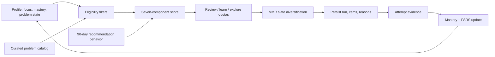

# Recommendation system

Invariant v2 uses an **explainable adaptive hybrid ranker** named `hybrid-v1`. It is deterministic for the same inputs and seed. It is not an LLM, collaborative-filtering model, trained neural ranker, or claim of state-of-the-art accuracy.

The system combines curated catalog metadata with a user’s explicit goals, observed mastery, per-problem review state, and bounded engagement history. Every recommendation stores its score components and user-facing reasons.

## Pipeline



The implementation is split between pure modules in [`src/lib/recommendation`](../src/lib/recommendation) and database orchestration in [`src/lib/services/recommendations.ts`](../src/lib/services/recommendations.ts) and [`src/lib/services/attempts.ts`](../src/lib/services/attempts.ts).

## Inputs that affect ranking

### User context

- experience level;
- learning goal and optional target date;
- minutes available for the requested session;
- selected focus topics and their stored priority;
- per-topic ability (`theta`), attempt count, effective successes, and last-practiced state;
- per-problem solve/outcome state, next-review date, scheduled interval, dismissal, and last-served time;
- up to 1,000 recommendation items from the last 90 days, summarized into per-topic impressions, starts, completions, and dismissals.

### Catalog context

- active/premium flags;
- topic weights and primary topic;
- curated IRT-style difficulty `b`;
- expected solve minutes;
- curated quality score;
- pattern label;
- primary-topic prerequisites.

### Data not currently used by the ranker

Platform snapshots, target role, preferred programming language, stored baseline-confidence values, attempt notes, recommendation opens, and bookmarks do not currently affect scores. External platform solves are aggregate display data and do not update per-topic mastery.

## Cold start and mastery

Onboarding initializes topic ability by experience level:

| Experience | Initial `theta` | Display mastery `sigmoid(theta)` |
| --- | ---: | ---: |
| Beginner | `-1.25` | about 22% |
| Intermediate | `-0.25` | about 44% |
| Advanced | `0.65` | about 66% |

For a problem with normalized topic weights `wᵢ`, topic abilities `θᵢ`, difficulty `b`, and discrimination `a = 1.7`:

```text
weightedTheta = Σ(wᵢ × θᵢ)
predictedSolveProbability = sigmoid(1.7 × (weightedTheta - b))
```

This predicted value is an internal IRT-style estimate based on curated difficulty and local attempt state. It has not been calibrated against held-out production outcomes.

### Updating mastery from an attempt

An attempt first becomes an effective outcome:

| Outcome | Effective value |
| --- | ---: |
| Failed | `0` |
| Abandoned | `0.15` |
| Partial | `0.35` |
| Solved | `0.55–1.0`, reduced by hints and excess time |

For a solved attempt, up to three hints subtract `0.10` each. Taking longer than the catalog estimate applies an additional bounded penalty. The value never falls below `0.55` for a solve.

For each weighted topic:

```text
learningRate = 0.35 / sqrt(1 + previousAttempts / 20)
thetaDelta = learningRate × topicWeight × (effectiveOutcome - predictedSolveProbability)
thetaAfter = clamp(thetaBefore + thetaDelta, -3, 3)
uncertainty = 1 / sqrt(1 + attemptCount)
```

The decreasing learning rate prevents one late attempt from overwhelming a long history. An abandonment under five minutes is not considered meaningful mastery evidence, although it still updates the per-problem FSRS card under the current implementation.

## Eligibility filters

Before scoring, a candidate is excluded when any applicable rule matches:

- duplicate problem ID or invalid required metadata;
- inactive problem;
- premium problem when `includePremium=false`;
- active seven-day dismissal;
- served in the last 24 hours, unless it is due for review;
- already solved and not due;
- primary-topic prerequisite below 40% mastery;
- mode mismatch.

`REVIEW` admits only due items. `LEARN` and `CHALLENGE` exclude due items so review work remains in its own lane. The service adapter currently derives prerequisites from the problem’s primary topic only.

Every exclusion is retained in diagnostics with stable exclusion codes. `includePremium` is only a request flag; there is no subscription or entitlement system in v2.

## Scoring model

Every component is clamped to `[0, 1]`, and configuration validation requires weights to sum to one.

```text
baseScore =
  0.24 × need
  + 0.18 × goalFit
  + 0.20 × reviewUrgency
  + 0.18 × difficultyFit
  + 0.08 × behavior
  + 0.07 × quality
  + 0.05 × exploration
```

| Component | Meaning |
| --- | --- |
| `need` | Topic-weighted, preference-weighted gap between current and target mastery. |
| `goalFit` | 75% focus-topic alignment plus 25% time fit. Over-budget problems get an exponential penalty, not a hard exclusion. |
| `reviewUrgency` | Zero until due; begins at 0.5 and rises with overdue time relative to the previous interval. Failed/abandoned reviews have a floor of 0.8 and partial reviews 0.65. |
| `difficultyFit` | Gaussian fit between predicted solve probability and the mode/goal target, with sigma `0.18`. |
| `behavior` | Smoothed topic start/completion rates minus dismissal rate. No history uses a neutral value of 0.5. |
| `quality` | Curated catalog quality score. |
| `exploration` | Deterministic UCB-style bonus for topics with fewer impressions. |

The exploration component is:

```text
clamp(sqrt(2 × ln(totalImpressions + 2) / (topicImpressions + 1)) / 2)
```

It is an exposure-count proxy. The stored mastery `uncertainty` field is displayed and updated but is not currently used in candidate selection.

## Mode and goal targets

Default desired solve probabilities are:

| Mode | Target |
| --- | ---: |
| Daily / Learn | 65% |
| Review | 80% |
| Internal Explore lane | 60% |
| Challenge | 45% |

Public API modes are `DAILY`, `LEARN`, `REVIEW`, and `CHALLENGE`. Explore is a reserved lane inside a daily feed rather than a public API mode.

Learning goals adjust target mastery and difficulty:

| Goal | Target mastery | Daily/Learn solve target | Challenge target |
| --- | ---: | ---: | ---: |
| Interview preparation | 80% | 65% | 45% |
| Competitive programming | 82% | 58% | 40% |
| Core fundamentals | 85% | 72% | 50% |
| Career switch | 78% | 68% | 47% |

When a target date is 45 days or fewer away, the service adds 0.04 to target mastery (capped at 0.92), adds 0.03 to the Daily/Learn solve target, and increases the normal/backlog review shares.

## Lanes and review quotas

A normal daily slate reserves `ceil(35% × limit)` for due reviews, with at least one review when any are due. When the due backlog is greater than twice the slate size, the target rises to 50%. Near a target date, those shares become 45% and 60%.

When a daily slate contains at least six items, the engine may reserve one Explore item. It must still align with a selected topic (`topicGoalFit ≥ 0.25`) and have a predicted solve probability between 35% and 80%. Explore selection uses:

```text
0.55 × baseScore + 0.45 × exploration
```

Quotas are targets, not absolute caps. If a lane cannot fill its allocation, remaining candidates are redistributed so a sparse catalog does not silently produce a short slate.

## Diversity and deterministic ordering

The engine applies maximal marginal relevance (MMR) with 85% relevance weight and 15% diversity penalty.

Candidate similarity is:

```text
0.70 × weightedTopicJaccard
  + 0.20 × samePatternOrPrimaryTopic
  + 0.10 × sameDifficulty
```

Outside Challenge mode, approximate slate constraints allow at most two items with one primary topic per five and at most one Hard problem per five for beginners. A constraint is relaxed only when every remaining candidate violates it.

Seeded FNV-1a tie-breaking makes the result reproducible for identical state and seed. A normal daily seed is stable for the user/mode/day; forced refresh adds the current time. Plan generation supplies its own stable seed.

The UI’s `matchPercent` is `finalScore × 100`. It is a relevance/diversity ranking score, **not** a probability or confidence interval. `predictedSolveProbability` is returned separately.

## Explainability and persistence

Each `RecommendationRun` persists:

- algorithm version and deterministic seed;
- mode and relevant request/profile context;
- generation diagnostics and exclusion counts;
- creation and expiry times.

Each `RecommendationItem` persists:

- rank and lane;
- base and final score;
- predicted solve probability;
- all seven component values;
- up to three reasons.

Reason codes are:

- `REVIEW_DUE`
- `MASTERY_GAP`
- `GOAL_ALIGNED`
- `DIFFICULTY_MATCH`
- `BEHAVIOR_AFFINITY`
- `HIGH_QUALITY`
- `EXPLORE_UNCERTAINTY`

When present, review timing is always the first reason. Other reasons are sorted by weighted score contribution, not by generated prose. The API returns the component record and human-readable labels so the UI can show why an item was chosen.

## Feedback and FSRS

### Recommendation events

The API accepts impression, open, start, dismiss, and bookmark events with ownership and per-user idempotency checks. A solved attributed attempt records completion internally.

Current ranking behavior uses impressions, starts, completions, and dismissals. Opens are recorded but not scored. Bookmark state is persisted but does not boost rank. Dismissal excludes the problem for seven days and expires all active feed runs for that user.

### Review scheduling

Invariant maintains one `ts-fsrs` card per user/problem with desired retention `0.90`, fuzz disabled, and short-term steps disabled.

| Evidence | FSRS rating |
| --- | --- |
| Failed or abandoned | Again |
| Partial | Hard |
| Solved with a hint or in more than 1.5× expected time | Hard |
| Solved in at most 0.6× expected time with confidence at least 4 | Easy |
| Other solve | Good |

Attempt persistence, mastery updates, review scheduling, activity aggregates, recommendation completion, and plan progress occur in one serializable transaction. Any successful new attempt expires active recommendation runs so stale mastery cannot continue serving.

## Feed caching and plan consumption

A compatible Daily feed is reused for up to 12 hours; other modes for up to 2 hours. Compatibility checks include mode, requested capacity, time budget, premium flag, experience, learning goal, and target date.

Profile/focus changes, attempts, and dismissals expire relevant active runs. Forced refresh bypasses reuse and changes the seed. Normal feed generation sets `lastServedAt`; plan-purpose recommendation runs do not, so generating a plan does not hide otherwise eligible feed items.

Study plans reuse Daily recommendation candidates with a stable plan seed, then a deterministic greedy scheduler:

- pulls due reviews earlier;
- balances estimated minutes across days;
- avoids same-topic, same-pattern, and multiple-Hard clusters where capacity permits;
- enforces one active plan per user at the database level.

## API surface

| Method and route | Relevant behavior |
| --- | --- |
| `GET /api/v1/recommendations` | `mode`, `limit` 1–20, `minutesAvailable` 5–720, `includePremium`; 60 requests/hour. |
| `POST /api/v1/recommendations/refresh` | Same recommendation context, same-origin mutation; 4 requests/hour. |
| `POST /api/v1/recommendation-events` | Strict owned event and idempotency payload; 300 requests/hour. |
| `POST /api/v1/attempts` | Strict evidence, optional recommendation attribution, same-origin, idempotent; 60 requests/hour. |

All require an authenticated user with completed onboarding. Validation, request-size controls, same-origin mutation checks, ownership, rate limiting, and idempotency are enforced at server boundaries.

## Test coverage

The core recommendation and planning suite has 30 tests: twenty-four directly exercise recommendation and mastery behavior, while six cover plan scheduling and lifecycle. Separate auth-policy and PostgreSQL integration suites extend the repository-wide coverage. Covered recommendation cases include:

- score bounds and weight validation;
- weak-topic and difficulty behavior;
- cold start and UCB exploration;
- eligibility exclusions and due-review exceptions;
- duplicate handling and malformed candidates;
- deterministic MMR, slate constraints, sparse fallback, quotas, and Explore reservation;
- outcome/hint/time mastery deltas and learning-rate decay;
- FSRS rating mapping;
- plan scheduling and terminal lifecycle.

The PostgreSQL-backed integration suite additionally exercises concurrent attempt idempotency, recommendation cache-context and dismissal behavior, evidence-driven plan completion, and stale platform-sync rejection.

## Evaluation limits and known risks

The current test suite establishes implementation behavior; it does not establish real-world recommendation quality.

Not yet present:

- held-out replay evaluation or real-user outcome studies;
- solve-probability calibration using Brier score or log loss;
- ranking evaluation such as NDCG, recall, or coverage at `k`;
- online experiment/A-B infrastructure;
- fairness, cold-start cohort, drift, regret, or reinforcement-bias analysis;
- learned weights or difficulty estimates;
- load/latency benchmarks for generation at large catalog/user-history scale.

Catalog difficulty, expected time, topics, pattern, and quality are manually curated. Fixed behavior weights can reinforce previously popular topics, although focus gating and the bounded Explore lane reduce that risk. The behavior query is bounded to 1,000 recent items and therefore becomes a sample for highly active accounts.

Before describing solve probability as calibrated or the ranker as state of the art, collect held-out and online evidence, version every material policy change, and publish performance by experience/goal cohort rather than only an aggregate metric.
